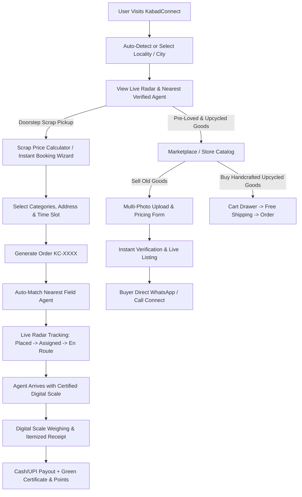

# 🌿 KabadConnect / KabadCollect — Complete Project Flow, Architecture & KT Documentation

> **Doorstep Scrap Pickup & Hyperlocal Circular Economy Marketplace Platform**  
> *"Swiggy for Kabad & OLX for Pre-Loved / Upcycled Goods"*

---

## 📑 Table of Contents
1. [Executive Summary & Core Value Proposition](#1-executive-summary--core-value-proposition)
2. [Technology Stack & Third-Party Libraries](#2-technology-stack--third-party-libraries)
3. [System Architecture & Folder Structure](#3-system-architecture--folder-structure)
4. [Database Schemas & Data Models (MongoDB / Mongoose)](#4-database-schemas--data-models)
5. [Complete End-to-End User Journeys & Workflow Diagrams](#5-complete-end-to-end-user-journeys--workflow-diagrams)
   - [User Role 1: Regular Citizen / Household User](#user-role-1-regular-citizen--household-user)
   - [User Role 2: Verified Scrap Partner / Field Agent](#user-role-2-verified-scrap-partner--field-agent)
   - [User Role 3: Platform Administrator](#user-role-3-platform-administrator)
6. [Key Feature Modules & Implementation Details](#6-key-feature-modules--implementation-details)
   - [6.1 Hyperlocal Live Radar & Proximity Matching](#61-hyperlocal-live-radar--proximity-matching)
   - [6.2 4-Step Doorstep Booking Wizard](#62-4-step-doorstep-booking-wizard)
   - [6.3 Live Order Tracker & Digital Weighing Lifecycle](#63-live-order-tracker--digital-weighing-lifecycle)
   - [6.4 Pre-Loved & Upcycled Goods Marketplace](#64-pre-loved--upcycled-goods-marketplace)
   - [6.5 Eco-Calculator & Green Certificate Generation](#65-eco-calculator--green-certificate-generation)
   - [6.6 Modern Cookie & Privacy Consent Engine](#66-modern-cookie--privacy-consent-engine)
7. [API Endpoints Reference](#7-api-endpoints-reference)
8. [Setup, Run & Deployment Guide](#8-setup-run--deployment-guide)
9. [Key Architectural Decisions, Gotchas & Best Practices](#9-key-architectural-decisions-gotchas--best-practices)

---

## 1. Executive Summary & Core Value Proposition

**KabadConnect** (also branded as **KabadCollect**) is an end-to-end hyperlocal marketplace that bridges Indian households, commercial premises, and informal scrap collectors (*kabadiwalas*). 

### Key Problems Solved:
1. **Unorganized Scrap Collection**: Inconsistent pricing, tampered mechanical scales, lack of reliability, and unpunctual kabadiwalas.
2. **Transparent Fair Pricing**: Real-time daily market rate ticker (Iron, Copper, Paper, E-waste, Brass, Plastic) updated dynamically.
3. **Certified Digital Scales & Trust**: Every partner uses verified digital scales with instant digital itemized billing receipts.
4. **Hyperlocal Visibility**: Live GPS radar shows active field agents roaming in the user's specific locality/city (Ahmedabad, Delhi NCR, Gurugram, etc.).
5. **Circular Economy & Secondhand Goods**: Buy and sell pre-loved appliances/furniture with real unedited photo galleries, and purchase upcycled products handcrafted from reclaimed materials.
6. **Gamified Environmental Impact**: Users earn Green Points and generate certified Environmental Contribution Badges (Trees Saved 🌳, Water Conserved 💧, CO₂ Diverted 💨).

---

## 2. Technology Stack & Third-Party Libraries

### 🖥️ Frontend (Client Application)
- **Framework**: [React 19](https://react.dev/) + [Vite 8](https://vitejs.dev/) (Lightning-fast HMR and optimized ES module bundling).
- **Styling Architecture**: Pure **Vanilla CSS** with comprehensive CSS Variables design system (`:root` tokens for palette, glassmorphism, smooth gradients, and dark/light modes).
- **Iconography**: [`lucide-react`](https://lucide.dev/) (Modern, lightweight vector iconography).
- **Maps & Geolocation**: [`mapbox-gl`](https://docs.mapbox.com/mapbox-gl-js/) integrated with fallback custom canvas radar & Haversine distance engine.
- **Smooth Scrolling**: [`lenis`](https://github.com/darkroomengineering/lenis) for fluid, modern momentum scrolling.
- **Celebration Animations**: [`canvas-confetti`](https://www.npmjs.com/package/canvas-confetti) for booking success and order completion milestones.

### ⚙️ Backend & API
- **Runtime**: [Node.js](https://nodejs.org/) (ES Modules `type: "module"`).
- **Serverless Architecture**: Vercel Serverless Functions (`/api/*` endpoints).
- **Database Layer**: [MongoDB Atlas](https://www.mongodb.com/atlas) with [Mongoose 9](https://mongoosejs.com/) ODM.
- **Email & Notifications**: [`nodemailer`](https://nodemailer.com/) (Transactional emails for OTP authentication, booking receipts, and contact support).
- **Environment Management**: `dotenv` for handling secure secrets (MongoDB URI, SMTP credentials, Mapbox keys).

---

## 3. System Architecture & Folder Structure

```
├── .env / .env.example        # Environment secrets (MONGODB_URI, SMTP, VITE_MAPBOX_TOKEN)
├── vercel.json                # Vercel serverless routing, headers & SPA rewrites
├── package.json               # Root scripts & shared dependencies
├── DEPLOYMENT.md              # Production deployment runbook
├── README.md                  # Quick project orientation
│
├── api/                       # Serverless Backend Micro-routes
│   ├── index.js               # Central API gateway & router
│   ├── _lib/                  # Shared database connection (db.js) & email transport
│   ├── _models/               # Mongoose Data Models
│   │   ├── User.js            # User accounts, roles, addresses, green stats
│   │   ├── Partner.js         # Scrap collector profiles, zones, vehicles, ratings
│   │   ├── Order.js           # Pickup bookings, itemized scale weights, status
│   │   ├── MarketplaceItem.js # Pre-loved & upcycled products
│   │   ├── ScrapRate.js       # Daily category market benchmark rates
│   │   ├── Ticket.js          # Customer support inquiries & disputes
│   │   └── Otp.js             # One-time login / registration verification codes
│   └── _routes/               # Route Handlers
│       ├── users.js           # Auth, OTP, Profile updates, Admin user management
│       ├── partners.js        # Directory, radar queries, status toggle, onboarding
│       ├── orders.js          # Booking lifecycle, status advancement, scale receipts
│       ├── rates.js           # Scrap rate queries & admin price edits
│       ├── marketplace.js     # Product listing, approval, search & filter
│       ├── tickets.js         # Helpdesk & contact form submissions
│       ├── config-db.js       # Database diagnostics & schema sanity checks
│       └── health.js          # System health check & ping endpoint
│
└── kabadconnect-web/          # React Single Page Application (SPA)
    ├── package.json           # Frontend dependencies & Vite scripts
    ├── vite.config.js         # Vite configuration with API proxying
    ├── index.html             # HTML entry point with meta tags & SEO
    └── src/
        ├── App.jsx            # Main root application layout & global state
        ├── main.jsx           # React DOM initialization & Lenis smooth scroll
        ├── components/
        │   ├── admin/         # Admin portal (Price management, user/partner manager)
        │   ├── agent/         # Partner portal (Duty toggle, assigned orders)
        │   ├── auth/          # OTP Modal, Login, Register, Avatar Crop
        │   ├── booking/       # 4-Step Booking Wizard Modal
        │   ├── calculator/    # Scrap value & Eco-savings estimator
        │   ├── common/        # Header, Footer, CookieConsentModal, Notifications
        │   ├── home/          # HeroSection, RateTicker, StatsBanner, Testimonials
        │   ├── kabadwala/     # HyperlocalMap (Live Radar), KabadwalaDirectory
        │   ├── marketplace/   # SellProductModal, ProductCard, FilterBar
        │   ├── orders/        # Order history cards, status pills
        │   └── tracking/      # LiveOrderTrackerModal, Scale Receipt, Green Certificate
        ├── data/              # Fallback static datasets (rates, mock partners, products)
        ├── pages/             # Route views (HomePage, ProfilePage, StorePage, CalculatorPage, RatesPage, ContactPage)
        ├── services/          # api.js (Universal HTTP client with offline fallback)
        ├── styles/            # Modular CSS files & design tokens
        └── utils/             # Geolocation math, date formatters, currency helpers
```

---

## 4. Database Schemas & Data Models

### 1. `User` Schema (`api/_models/User.js`)
- `name` *(String, required)*
- `phone` *(String, required, unique)*
- `email` *(String)*
- `role` *(String: `'user'` | `'partner'` | `'admin'`, default: `'user'`)*
- `avatar` *(String Base64 / URL)*
- `addresses` *(Array of `{ label, addressLine, locality, city, pincode, isDefault }`)*
- `greenStats` *(`{ pickupsCompleted, totalWeightKg, co2DivertedKg, treesSaved, waterSavedLiters, greenPoints }`)*
- `isActive` *(Boolean, default: `true`)*

### 2. `Partner` Schema (`api/_models/Partner.js`)
- `name` *(String, required)*
- `phone` *(String, required, unique)*
- `photo` *(String Base64 / URL)*
- `city` *(String: `'Ahmedabad'` | `'Delhi NCR'` | `'Gurugram'` | etc.)*
- `operatingZone` *(String, e.g. `'Bopal - SG Highway'`)*
- `location` *(`{ lat: Number, lng: Number }`)*
- `vehicleType` *(String: `'E-Rickshaw'` | `'Mini Truck'` | `'Eco-Cycle Van'`)*
- `vehicleNumber` *(String)*
- `isVerified` *(Boolean, default: `true`)*
- `isOnline` *(Boolean, default: `true`)*
- `digitalScaleCertified` *(Boolean, default: `true`)*
- `rating` *(Number, default: `4.9`)*
- `reviewsCount` *(Number, default: `0`)*

### 3. `Order` Schema (`api/_models/Order.js`)
- `orderId` *(String, unique, e.g. `'KC-8921'`)*
- `userId` *(String / ObjectId, ref: `'User'`)*
- `partnerId` *(String / ObjectId, ref: `'Partner'`)*
- `status` *(String: `'placed'` ➔ `'assigned'` ➔ `'en_route'` ➔ `'weighing'` ➔ `'completed'` | `'cancelled'`)*
- `categories` *(Array: `['Paper', 'Metals', 'Plastics', 'E-Waste']`)*
- `estimatedWeight` *(String: `'< 20 kg'`, `'20-50 kg'`, etc.)*
- `address` *(`{ addressLine, locality, city, pincode, floor, hasElevator }`)*
- `pickupSlot` *(`{ date: String, slot: String }`)*
- `scaleReceipt` *(`{ items: [{ category, ratePerKg, measuredWeightKg, totalAmount }], grandTotalAmount, totalWeightKg }`)*
- `ecoImpact` *(`{ co2DivertedKg, treesSaved, waterSavedLiters }`)*
- `otp` *(String 4-digit completion code)*

### 4. `MarketplaceItem` Schema (`api/_models/MarketplaceItem.js`)
- `title` *(String, required)*
- `category` *(String: `'Furniture'`, `'Electronics'`, `'Appliances'`, `'Bicycles'`, `'Upcycled Decor'`)*
- `condition` *(String: `'Like New'`, `'Good'`, `'Refurbished'`)*
- `price` *(Number, required)*
- `originalPrice` *(Number)*
- `images` *(Array of Strings / Base64 photos, up to 6 real unedited images)*
- `sellerId` *(String / ObjectId)*
- `sellerName` *(String)*
- `sellerPhone` *(String)*
- `city` *(String)*
- `status` *(String: `'available'` | `'sold'` | `'pending_review'`)*

---

## 5. Complete End-to-End User Journeys & Workflow Diagrams



### User Role 1: Regular Citizen / Household User
1. **Browse Scrap Rates**: Check daily fluctuating scrap prices with Hindi vernacular terms (*Akhbaar, Loha, Tamba, Peetal*).
2. **Estimate Value**: Use interactive sliders on the **Eco-Calculator** to calculate expected revenue and trees saved.
3. **Book Pickup**: In 4 quick steps, schedule doorstep pickup with date, time slot, and elevator status.
4. **Live Track & Verification**: Track assigned agent's live movement on the interactive radar map with safety OTP verification.
5. **Get Paid**: Receive instant UPI/cash upon accurate digital scale measurement and download the official **Green Environmental Certificate**.
6. **Sell / Buy Secondhand**: List unused electronics/furniture or buy upcycled eco-friendly products.

### User Role 2: Verified Scrap Partner / Field Agent
1. **Onboarding**: Register with vehicle details (E-rickshaw / Mini truck) and digital scale certification.
2. **Duty Toggle**: Switch `Online` / `Offline` status from the Agent Dashboard.
3. **Order Reception**: Receive pickup assignments in their operating zone with customer location, phone, and estimated scrap load.
4. **Fulfillment**: Update status (`En Route` ➔ `Weighing` ➔ `Completed`), enter measured weights per category into the digital scale portal, and finalize pickup.

### User Role 3: Platform Administrator
1. **Manage Scrap Rates**: Update daily per-kilogram rates across metals, paper, plastics, and e-waste.
2. **Fleet & Partner Monitoring**: View all registered field agents across cities on the live radar, verify credentials, and manage active duty status.
3. **Order Surveillance**: Oversee order fulfillment pipeline and resolve customer support tickets.
4. **Marketplace Moderation**: Review, approve, or mark secondhand product listings.

---

## 6. Key Feature Modules & Implementation Details

### 6.1 Hyperlocal Live Radar & Proximity Matching
- Located prominently on the Home Page right below the Hero Banner.
- Powered by `HyperlocalMap.jsx` and `geolocation.js`.
- Queries registered field agents from MongoDB, filters them strictly by the user's selected city (`Ahmedabad`, `Delhi NCR`, `Gurugram`), and computes real Haversine distance in kilometers.
- Prioritizes real database agents (`isRealDbAgent: true`) and generates visual radar pulses, vehicle markers, and live route lines.

### 6.2 4-Step Doorstep Booking Wizard
- **Step 1 — Scrap Categories**: Checkboxes for Paper, Plastics, Metals, E-Waste, Appliances + approximate weight tier (<20kg, 20-50kg, 50-100kg, 100kg+).
- **Step 2 — Doorstep Address**: Street address, locality, landmark, pincode, floor number, and elevator availability toggle.
- **Step 3 — Date & Time Slot**: Today Express (within 45-60 mins), Tomorrow Morning (9 AM - 1 PM), Tomorrow Evening (2 PM - 7 PM), or Weekend.
- **Step 4 — Instant Confirmation**: Generates a unique tracking ID (`KC-XXXX`), triggers celebratory confetti via `canvas-confetti`, and immediately opens the live tracking radar.

### 6.3 Live Order Tracker & Digital Weighing Lifecycle
- Features a real-time stepper modal (`LiveOrderTrackerModal.jsx`):
  1. `Placed`: Order received and logged.
  2. `Assigned`: Matched with nearest verified partner (e.g., *Hiren M - 4.9⭐*).
  3. `En Route`: Partner driving to doorstep with live distance countdown.
  4. `Digital Weighing`: Partner inputs exact weights per material.
  5. `Completed`: Cash/UPI payout confirmed, OTP verified.
- **Itemized Digital Scale Receipt**: Displays transparent breakdown of weights, rates, total payout, and certified scale calibration ID.
- **Green Contribution Certificate**: Generates a shareable visual badge highlighting exact kg of CO₂ saved, liters of water conserved, and trees preserved.

### 6.4 Pre-Loved & Upcycled Goods Marketplace
- **Sell Product Modal (`SellProductModal.jsx`)**:
  - Multi-image gallery supporting up to **6 real unedited photos**.
  - One-click photo upload, cover photo selector, and delete controls.
  - Category presets (Almirah, AC, Dining Table, Study Table, Sofa, Bed, Refrigerator, Washing Machine, Cycles).
  - Price expectation, condition tag, negotiable badge, and direct seller WhatsApp/Call contact.
- **Upcycled Store (`StorePage.jsx`)**:
  - Handcrafted items created from recycled materials (Eco Kraft notebooks, tyre ottomans, scrap metal lamps, ocean-bound plastic bags).
  - Dynamic Slide-out Cart Drawer with quantity controls, free delivery progress bar, and instant checkout.

### 6.5 Eco-Calculator & Green Certificate Generation
- **Dynamic Formulae**:
  - $\text{Trees Saved} = (\text{Paper kg} \times 0.017) + (\text{Plastic kg} \times 0.002)$
  - $\text{CO}_2\text{ Diverted (kg)} = (\text{Paper kg} \times 0.9) + (\text{Metal kg} \times 2.1) + (\text{Plastic kg} \times 1.5) + (\text{E-Waste kg} \times 3.2)$
  - $\text{Water Conserved (L)} = (\text{Paper kg} \times 26) + (\text{Plastic kg} \times 12)$
- Pre-loads calculated scrap estimates directly into the Booking Wizard.

### 6.6 Modern Cookie & Privacy Consent Engine
- **Eco-Themed Banner (`CookieConsentModal.jsx`)**:
  - Glassmorphic design matching the site's dark/light green theme.
  - Granular consent preferences: **Essential (Strictly Required)**, **Geolocation & Live Radar**, and **Performance & Analytics**.
  - Persisted in browser `localStorage` under `kc_cookie_consent_v1`.
  - Reconfigurable anytime via the "Cookie Settings" link in the global Footer.

---

## 7. API Endpoints Reference

| Method | Endpoint | Description | Auth / Role |
|---|---|---|---|
| `GET` | `/api/health` | Server uptime & database connection status | Public |
| `POST` | `/api/users?action=send-otp` | Generate & email/SMS 6-digit OTP | Public |
| `POST` | `/api/users?action=verify-otp` | Verify OTP & return authenticated user object | Public |
| `GET` | `/api/users?action=profile&id=:id` | Fetch user profile, addresses & green impact | Authenticated |
| `PUT` | `/api/users?action=update-profile` | Update profile, avatar & address list | Authenticated |
| `GET` | `/api/partners?city=:city` | Fetch active verified partners filtered by city | Public |
| `POST` | `/api/partners?action=register` | Onboard new scrap collection partner | Public |
| `PUT` | `/api/partners?action=toggle-status` | Toggle partner online/offline duty status | Partner |
| `GET` | `/api/orders?userId=:id` | Fetch order history for user | Authenticated |
| `POST` | `/api/orders?action=create` | Create new scrap pickup booking | Authenticated |
| `PUT` | `/api/orders?action=update-status` | Advance order status (En Route, Weighing, Completed) | Partner / Admin |
| `GET` | `/api/rates` | Fetch all current scrap material benchmark prices | Public |
| `PUT` | `/api/rates?action=update` | Update per-kg market rate | Admin |
| `GET` | `/api/marketplace` | Fetch pre-loved and upcycled listings | Public |
| `POST` | `/api/marketplace?action=create` | Create new secondhand product listing | Authenticated |
| `POST` | `/api/tickets` | Submit customer support inquiry or dispute | Public |

---

## 8. Setup, Run & Deployment Guide

### 🛠️ Prerequisites
- Node.js `v18.0.0` or higher
- MongoDB Atlas cluster URI or local MongoDB instance
- Git

### 🚀 Local Development Setup

```bash
# 1. Clone the repository
git clone https://github.com/Yogeshalbiorix/kabadconnect.git
cd kabadconnect

# 2. Configure Environment Variables
# Copy .env.example to .env and fill in MONGODB_URI and SMTP details:
cp .env.example .env

# 3. Install Root & Frontend Dependencies
npm install
npm --prefix kabadconnect-web install

# 4. (Optional) Seed Initial Database Records
npm run seed-db

# 5. Start the Vite Development Server
npm run dev
```
> The application will be live at `http://localhost:5173`.

### 🌐 Production Deployment (Vercel)
1. Push your changes to GitHub repository on `main` branch.
2. Link the repository to your [Vercel](https://vercel.com) account.
3. Configure Project Settings in Vercel:
   - **Framework Preset**: `Vite`
   - **Root Directory**: `./`
   - **Build Command**: `npm --prefix kabadconnect-web run build`
   - **Output Directory**: `kabadconnect-web/dist`
4. Add Environment Variables in Vercel Dashboard:
   - `MONGODB_URI`: Your production MongoDB Atlas connection string.
   - `SMTP_USER` & `SMTP_PASS`: For email delivery.
   - `VITE_MAPBOX_TOKEN`: (Optional) For high-resolution satellite tiles.
5. Deploy.

---

## 9. Key Architectural Decisions, Gotchas & Best Practices

1. **Vercel SPA Rewrites & Static Asset MIME Types**:
   - *Problem*: A blanket rewrite `"source": "/(.*)"` causes missing `.js` or `.css` chunks to return `index.html` with status 200 and MIME type `text/html`, triggering `Failed to load module script` browser crashes.
   - *Solution*: Use restricted regex `"source": "/((?!assets/|favicon|.*\\..*).*)"` and set `Cache-Control: no-cache, no-store, must-revalidate` for `index.html` while setting immutable long-term caching for `/assets/*`.

2. **Safe Mongoose ObjectId Queries**:
   - *Problem*: Querying MongoDB with string identifiers (e.g. `usr-1741...`) against `_id` triggers Mongoose `CastError: Cast to ObjectId failed`.
   - *Solution*: Always check if the string matches `^[0-9a-fA-F]{24}$` before querying `_id` in `$or` filters.

3. **Universal Haversine Distance Signature**:
   - *Problem*: Destructuring `[lat1, lon1]` from an object `{ lat, lng }` or passing 4 numeric arguments causes `TypeError: e is not iterable`.
   - *Solution*: `calculateDistanceKm` is normalized to accept all input formats (array coordinates, numeric tuples, or `{ lat, lng }` objects) with fallback to `0.0 km`.

4. **Offline Resilience & Demo Mode**:
   - If the backend database is unreachable or offline during local frontend development, `api.js` automatically falls back to curated static datasets in `/src/data/`, ensuring the user interface remains responsive and testable at all times.

---
*Created for KabadConnect Core Engineering Team & Knowledge Transfer.*
